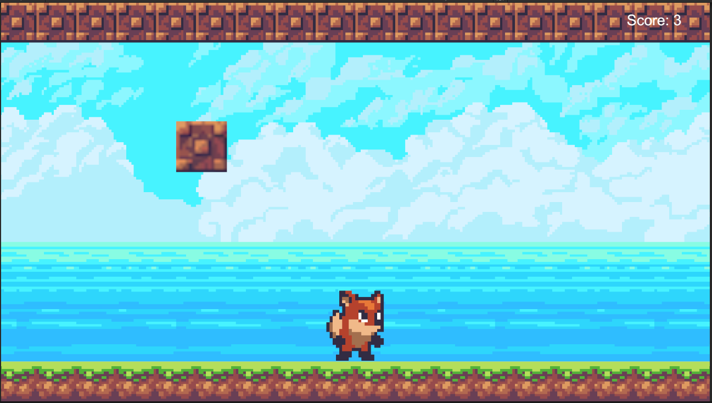
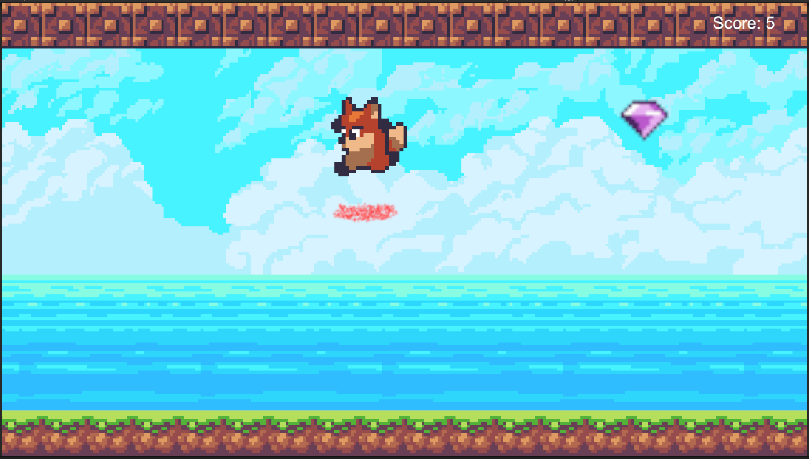

## Penjelasan
Game dengan objektif menghindari blok dan menangkap gem/cherry

Efek api saat jump

## Cara Bermain
Control: \
Kiri: A \
Kanan: D \
Jump: space 

  
Jika player mendapatkan cherry, dapat 3 poin  
  
  
Jika player mendapatkan gem, dapat 5 poin  
  
  
Jika player mendapatkan block, dapat -4 poin 
